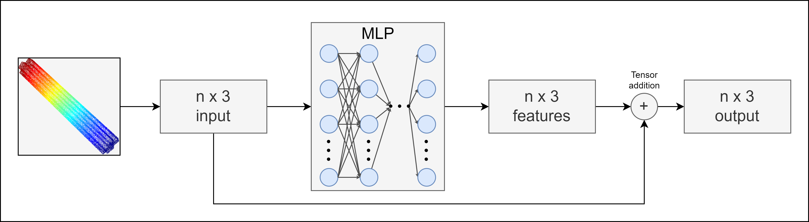

## Installation
Python virtual environment from 
Python 3.7.6. (or 3.7.7. if distribution versions of python libraries don't exist)
```
python -m venv venv
```
or
```
python3 -m venv venv
```
Update pip
```
python -m pip install --upgrade pip
```
Install dependencies from `requirements.txt`
```
pip install -r requirements.txt
```
Install project as package
```
pip install -e .
```
Adjust `config.py` with path to the CC3D/CC3D-PSE dataset introduced in 
<a href="https://cvi2.uni.lu/sharp2022">SHARP</a> challenges (permission
needed from the authors of the dataset).

## Tensorflow software requirements:
Since we're using <a href="https://www.tensorflow.org/install/pip">Tensorflow 2.8.0</a>,
for Tensorflow 2.x.y it's required to install:
- <a href="https://developer.nvidia.com/cuda-11.2.0-download-archive">CUDA 11.2</a>
- <a href="https://developer.nvidia.com/rdp/cudnn-archive">cuDNN 8.1.0</a> for CUDA 11.2

Useful links:
- <a href="https://docs.nvidia.com/deeplearning/cudnn/install-guide/index.html">How to install cuDNN</a>

## Dataset Preparation
Run `utils/dataset.py` that will parse the dataset and create h5py version 
saved to `datasets` folder based on `config.py` settings in format
```
datasets/cc3d-pse-{NUM_POINTS}(^$|-ordered)(^$|-edges).h5
```
e.g. if `config.py` has the following values of variables
```
...
ORDERED = True
EDGES_ONLY = True
NUM_POINTS = 2048
...
```
`createDataset()` in `utils/dataset.py` will generate 
`datasets/cc3d-pse-2048-ordered-edges.h5py`.

## Models and Training
Models are available in `models` and `experimental_models`. Which dataset, what batch size, and CPU/GPU
training is determined from `config.py`. Model hyperparameters are defined inside each model file.

### Predict offsets
`models/predict_offsets.py`


Predict vector offsets to each point in a point cloud that comes on the 
input to the network.
Predicted offsets are then added to each point, resulting in a new point
cloud with shifted points.

### Generate new point clouds
`models/autoencoder.py`

Using PointNet [[1]](#1) as encoder and MLP as decoder to generate 
new point clouds closer to ground truth. We're training the model with Chamfer
distance defined in [[2]](#2).

## Pushing new changes
- pip freeze > requirements.txt if there are new or updated libraries that weren't manually or
automatically by some software added to the requirements.txt.
- Remove project package from the requirements.txt created by `pip install -e .` command.

## References
<a id="1">[1]</a>
Charles Ruizhongtai Qi et al. “PointNet: Deep Learning on Point Sets for 
3D Classification and Segmentation”. In: CoRR abs/1612.00593 (2016).
arXiv: 1612.00593. url: http://arxiv.org/abs/1612.00593.

<a id="2">[2]</a>
Haoqiang Fan, Hao Su, and Leonidas J. Guibas. “A Point Set Generation Network for
3D Object Reconstruction from a Single Image”. In: CoRR abs/1612.00603 (2016).
arXiv: 1612.00603. url: http://arxiv.org/abs/1612.00603.